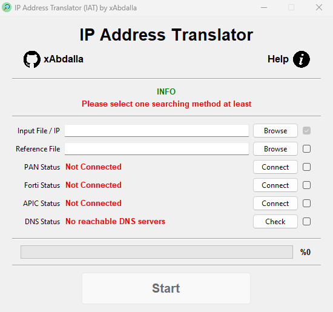

# IP Address Translator (IAT)


[](https://github.com/xAbdalla/IP_Address_Translator/releases/tag/v1.5)
[](https://github.com/xAbdalla/IP_Address_Translator?tab=MIT-1-ov-file#readme)
[](https://github.com/xAbdalla)

IP Address Translator is a Python script that maps IP addresses to descriptive object names or domain names. With a GUI interface and a simple design, the script is easy to use by anyone.

<p align= "center" style="text-align: center"></p>

## Features

### Various Input Options
- Accepts Excel, CSV, or Text files.
- Direct input of a single IP address, subnet, range, or list of them separated by comma.

  ####   Files Specifications
    - All files must have its proper extension.
    - Input Text files must have one subnet per line.
    - Input CSV files must have a column named `Subnet`.
    - Input Excel files could have multiple sheets; each must contain a column named `Subnet`.
    - Reference CSV files require three columns: `Tenant`, `Address object`, and `Subnet`.
    - Reference Excel files could have multiple sheets, each must contain the three columns.
    - Check the provided [examples](res/examples) for the correct format.

### Various Searching Methods
- **Reference File**: Searches for matches in a user-provided reference file.
- **Palo Alto**: Connects via Palo Alto device REST API to import address objects.
- **Fortinet**: Connects via FortiGate REST API to retrieve address objects.
- **Cisco ACI**: Connects via SSH to APIC and import address objects based on the specified Class(es).
- **Reverse DNS**: Resolves IPs to domain names using the PTR records.

  ####   Palo Alto Device Specifications
    - Ensure Panorama/Firewall is reachable and you have REST API access/enable.
    - Leave "VSYS" field empty if you want to import address objects from all virtual systems.
  
  ####   Fortinet FortiGate Specifications
    - Ensure FortiGate is reachable and you have REST API access/enable.
    - Leave "VDOM" field empty if you want to import address objects from all virtual domains.
    
  ####   Cisco ACI Specifications
    - Ensure APIC is reachable and has CLI access.
    - Specify the Class(es) of the address objects to be searched.
    - The program searches the "dn" attribute exclusively.
    
  ####   DNS Resolver
    - Resolves IPs to domain names using the system DNS servers or a user-provided DNS servers.
    - You can specify up to four DNS servers.
  
  ####   Invalid Objects
    - FQDN Objects.
    - Object name is a valid IP or subnet.
    - Object name is `network_` and a valid IP or subnet.
    - Object address is `0.0.0.0/0` or `0.0.0.0/32`.

### Encrypted Credentials Storage
- An option to save your credentials for future use and avoid re-entering them.
- Credentials are stored locally in the application directory.
- Stored information is encrypted for security purposes.
- The encryption key is unique to each user and machine.

### Saving the Output
- Results are exported to a new Excel (.xlsx) file for ease of access and analysis.
- The generated file contains the original data along with the mapped names.
- The user can specify the output file name and location to prevent overwriting.

### Logging
- Detailed logs are generated for each operation.
- Logs are saved in a separate file for future reference.
- Logs are also displayed in the GUI for immediate feedback.
- Logs are color-coded for better readability.

### Error Handling
- Detailed error messages are displayed in the GUI.
- Logs are generated for each error for future reference.
- Errors are color-coded for better readability.

## Requirements
- Install [Python 3](https://www.python.org/downloads/) (v3.12 recommended).
- Install the required packages using the following command:
  ```commandline
  pip install -r requirements.txt
  ```
   #### Build Executable
    - You can find prebuilt executable files in the [release page](https://github.com/xAbdalla/IP_Address_Translator/releases).
    - To build the executable file, you need to install the following packages:
    ```commandline
     pip install pyinstaller
     ```
    - Run the following command to build the executable file:
    ```commandline
       pyinstaller --name "IP_Address_Translator_v1.5" --onefile --windowed --icon "res/img/IAT_icon.ico" --splash "res/img/IAT_splash.png" --disable-windowed-traceback "main.py"
     ```
    - If you want to compress the executable file, you can use [UPX](https://upx.github.io/) by adding the following flag to the above command:
    ```text
       --upx-dir "path/to/upx/folder" --upx-exclude "python3.dll" --upx-exclude "_uuid.pyd"
     ```
    - The executable file will be generated in the 'dist' folder.

## Usage
- Run the executable file or run the script using the following command:
  ```commandline
    python "main.py"
  ```
- Fill in the required fields and select the desired search method.
- Ensure the chosen search methods are accessible and correctly configured.
- Provide the necessary credentials and remember to save them if needed.
- For Cisco ACI, you must specify the correct Class for targeted searches.
- Review the generated Excel file for mapped IPs based on the selected search methods.
- Review the logs for detailed information about the operation.
- For any issues or inquiries, please contact the author.

  ### Output File Structure
    - The output file will have the same sheet names as the input file.
    - Each sheet will have multiple columns:
      - `Subnet`| The original IP address or subnet from the input file.
      - `Reference`: The location of the address object.
      - `Tenent`: The tenant/vsys/vdom of the address object.
      - `Address Object`: Name of the address object in the reference.
      - `Ref Subnet`: The reference subnet of the address object.
      - `Type`: type of the **Ref Subnet**.
      - `S/M`: (Single or Multiple) Indicates if it found in multiple places.

## Contributing
Feel free to contribute to this project by forking it and submitting a pull request.